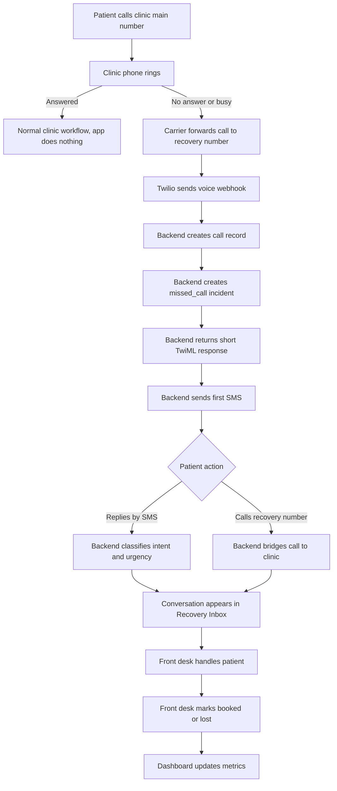

# 01 — User Flows

Project: Missed-call recovery SaaS for small dental clinics  
Version: MVP v1  
Audience: AI coding agent / technical implementer  
Status: Final reviewed build-spec file

---

## 1. Flow overview

The product has one main business workflow:

```text
Missed clinic call -> recovery SMS -> patient reply/callback -> front desk handoff -> booked/lost outcome.
```

The app should be designed around this workflow. Do not design the MVP as a general CRM, chatbot, inbox platform, or phone system.

---

## 2. Actors

### Patient

Calls the clinic and may receive/reply to SMS.

### Front desk

Handles recovered conversations and marks outcomes.

### Clinic owner

Reviews performance, billing, and clinic settings.

### Platform admin

Helps onboard clinics, verifies setup, and supports early pilot operations.

### Twilio

Provides voice/SMS infrastructure and webhooks.

### Stripe

Provides subscription billing and customer portal.

---

## 3. Main system flow



---

## 4. Flow 1 — Clinic signup and setup

### Goal

Create a clinic account and collect enough information to prepare Twilio, SMS, forwarding, and billing.

### Primary actor

Clinic owner.

### Preconditions

- Owner has access to the app.
- Owner is authorized to configure clinic communication settings.

### Steps

1. Owner creates account.
2. Owner enters clinic name.
3. Owner enters main clinic phone number.
4. Owner enters callback destination number.
5. Owner enters timezone.
6. Owner enters business hours.
7. Owner enters emergency instruction text or emergency phone.
8. Owner confirms that the app does not replace the main phone line.
9. System creates clinic record with status `signup_started`.
10. Platform admin or setup flow assigns recovery number.
11. Clinic configures no-answer / busy forwarding to recovery number.
12. Platform admin performs live missed-call test.
13. Platform admin performs live SMS test.
14. Clinic status becomes `activation_ready`.
15. Owner starts trial/subscription through Stripe.

### Expected result

Clinic is ready to process real missed-call recovery events.

### Notes for AI agent

- Do not start trial automatically on signup.
- Keep activation as a separate state.
- Early version may require admin/concierge manual actions.

---

## 5. Flow 2 — Normal answered call

### Goal

Ensure the product does nothing when the clinic answers normally.

### Primary actor

Patient and front desk.

### Steps

1. Patient calls clinic main number.
2. Front desk answers.
3. Call continues through existing phone system.
4. App receives no event.
5. No SMS is sent.
6. No missed-call incident is created.

### Expected result

The app stays out of the way.

### Notes for AI agent

The product only participates when the call is forwarded to the recovery number.

---

## 6. Flow 3 — Missed call creates recovery incident

### Goal

Detect a missed call and create the internal recovery objects.

### Primary actor

Patient.

### System actor

Twilio voice webhook.

### Preconditions

- Clinic has a recovery number.
- Clinic forwarding is configured.
- Twilio voice webhook URL is configured.

### Steps

1. Patient calls clinic main number.
2. Clinic does not answer or line is busy.
3. Phone provider forwards call to recovery number.
4. Twilio sends `POST /api/webhooks/twilio/voice/incoming`.
5. Backend validates Twilio signature.
6. Backend finds clinic by recovery number.
7. Backend stores raw Twilio payload.
8. Backend creates `calls` row.
9. Backend creates `missed_calls` row.
10. Backend opens or creates `patients` row based on caller phone.
11. Backend opens or creates `conversations` row.
12. Backend returns simple TwiML response.
13. Backend schedules first SMS.

### Expected result

A missed-call incident exists and first SMS is queued.

### Idempotency requirement

Duplicate webhook with the same `CallSid` must not create duplicate calls or missed-call incidents.

---

## 7. Flow 4 — First SMS after missed call

### Goal

Text the patient quickly after the missed call.

### Primary actor

System.

### Steps

1. Missed-call incident is created.
2. System waits configured delay, default 10–20 seconds.
3. System selects first missed-call template.
4. System sends SMS via Twilio Messaging Service.
5. System stores outbound `messages` row.
6. Twilio sends message status callback.
7. System updates message status.

### Default first SMS

```text
Hi, this is {clinic_name}. Sorry we missed your call. What do you need help with? Reply: 1 New patient, 2 Existing patient, 3 Tooth pain, 4 Cleaning, 5 Reschedule. Reply STOP to opt out.
```

### Expected result

Patient receives a useful message and can reply with either a number or free text.

### Notes for AI agent

- The first SMS must include opt-out language.
- The first SMS should not include diagnosis, treatment advice, or PHI-heavy content.
- Store the exact sent body for audit/debugging.

---

## 8. Flow 5 — Patient replies by SMS

### Goal

Capture patient intent and show the conversation in the recovery inbox.

### Primary actor

Patient.

### System actor

Twilio inbound messaging webhook.

### Steps

1. Patient replies to SMS.
2. Twilio sends `POST /api/webhooks/twilio/messaging/incoming`.
3. Backend validates Twilio signature.
4. Backend finds clinic by recovery number / destination number.
5. Backend finds patient by `From`.
6. Backend finds open conversation.
7. Backend stores inbound message.
8. Backend classifies intent.
9. Backend classifies urgency.
10. Backend updates conversation.
11. Backend creates or updates appointment opportunity.
12. Backend cancels pending automated follow-ups.
13. Conversation appears in Recovery Inbox.

### Intent mapping v0

```text
1 -> new_patient
2 -> existing_patient
3 -> urgent_tooth_pain
4 -> cleaning
5 -> reschedule
```

Keyword fallback:

```text
pain, toothache, swelling, emergency -> urgent_tooth_pain
cleaning -> cleaning
reschedule, move, cancel -> reschedule
appointment, book, schedule -> appointment_request
new patient, first time -> new_patient
```

### Expected result

The front desk can see what the patient needs and act quickly.

---

## 9. Flow 6 — Urgent dental issue

### Goal

Prioritize urgent patient replies without pretending to diagnose.

### Primary actor

Patient.

### Steps

1. Patient replies with `3`, `pain`, `toothache`, `swelling`, `emergency`, or similar.
2. System classifies conversation as urgent.
3. System creates/updates opportunity with urgency `urgent`.
4. Conversation moves to top of Recovery Inbox.
5. Front desk sees urgent label.
6. Optional urgent template is sent if configured.

### Suggested urgent response

```text
We marked this as urgent. If you have swelling, trauma, uncontrolled bleeding, or severe pain, please call the office now at {main_phone}. If this is life-threatening, call 911.
```

### Expected result

Urgent messages are clearly visible to the clinic, while the system avoids diagnosis or medical advice.

### Notes for AI agent

- This is urgency routing, not medical triage.
- Avoid collecting detailed symptoms in v1.

---

## 10. Flow 7 — No patient reply / follow-ups

### Goal

Follow up without spamming.

### Primary actor

System.

### Preconditions

- First SMS was sent.
- No inbound reply.
- No patient callback.
- Patient has not opted out.

### Steps

1. System waits 15 minutes after first SMS.
2. If no reply/callback/opt-out, sends follow-up 1.
3. System schedules next-business-day follow-up.
4. On next business day around 9:00 clinic local time, system checks again.
5. If still no reply/callback/opt-out and incident is open, sends follow-up 2.
6. System sends no more automated SMS for this incident.

### Rules

```text
Max automated SMS per missed-call incident: 3
Any inbound SMS cancels pending follow-ups
Any callback cancels pending follow-ups
STOP cancels pending follow-ups and blocks future sends
```

### Expected result

The app follows up enough to recover opportunities, but does not behave like spam.

---

## 11. Flow 8 — Patient calls recovery number back

### Goal

Bridge patient callback to clinic front desk.

### Primary actor

Patient.

### System actor

Twilio voice webhook.

### Preconditions

- Patient previously received SMS.
- There is an open recovery conversation or recent outbound recovery SMS.

### Steps

1. Patient calls recovery number.
2. Twilio sends voice webhook.
3. Backend validates Twilio signature.
4. Backend detects likely callback using conversation history.
5. Backend returns TwiML `<Dial>` to clinic callback destination.
6. Twilio attempts to connect patient to clinic.
7. Twilio sends call status callbacks.
8. Backend stores callback attempt and outcome.
9. Pending follow-ups are canceled.
10. Conversation/opportunity updates in inbox.

### Callback detection heuristic v0

A call to the recovery number is likely a callback if:

- `ForwardedFrom` is absent; and
- caller phone has an open recovery conversation; and
- the last outbound recovery SMS was sent before the current inbound call.

A call is likely a forwarded missed call if:

- `ForwardedFrom` exists and matches the clinic main number; or
- there is no open conversation for this caller.

When uncertain, default to missed-call safety-net behavior rather than silently dropping the call.

### Expected result

Patient can reach the clinic after receiving the recovery SMS.

---

## 12. Flow 9 — Front desk handles conversation

### Goal

Let clinic staff convert the recovery opportunity into a booked appointment or close it.

### Primary actor

Front desk user.

### Steps

1. Front desk opens Recovery Inbox.
2. User sees open conversations sorted by urgency and recency.
3. User opens conversation detail.
4. User reviews missed call, SMS thread, intent, urgency, and notes.
5. User contacts patient outside or inside workflow as needed.
6. User marks one of:
   - contacted;
   - booked;
   - lost;
   - follow-up needed;
   - paused.
7. System updates opportunity status.
8. Dashboard metrics update.

### Expected result

The product can prove recovered appointment outcomes without PMS integration.

### Notes for AI agent

- Manual mark-booked is required in MVP.
- Do not build automatic PMS booking in v1.

---

## 13. Flow 10 — Owner reviews dashboard

### Goal

Show whether the product is recovering revenue.

### Primary actor

Clinic owner.

### Steps

1. Owner opens dashboard.
2. Owner selects date range.
3. Dashboard displays:
   - missed calls;
   - SMS sent;
   - reply rate;
   - callback rate;
   - urgent incidents;
   - appointment opportunities;
   - booked appointments;
   - estimated recovered revenue.
4. Owner can open the related opportunities.

### Expected result

Owner understands product value in business terms.

---

## 14. Flow 11 — Patient opts out

### Goal

Respect opt-out and stop automated messaging.

### Primary actor

Patient.

### Steps

1. Patient replies `STOP` or another configured opt-out keyword.
2. Twilio may process Advanced Opt-Out.
3. Backend receives inbound SMS webhook with body and possibly `OptOutType`.
4. Backend stores inbound message.
5. Backend updates patient consent status to opted out.
6. Backend cancels pending follow-ups.
7. Backend prevents future automated sends to that patient.

### Expected result

No future automated SMS is sent to opted-out patient.

### Notes for AI agent

- Assume Twilio Advanced Opt-Out is enabled at the Messaging Service level.
- Still store opt-out state locally.

---

## 15. Flow 12 — Admin activates first pilot clinics

### Goal

Support concierge onboarding for first 5–10 clinics.

### Primary actor

Platform admin.

### Steps

1. Admin opens internal clinic list.
2. Admin reviews clinic setup fields.
3. Admin assigns or verifies recovery number.
4. Admin verifies Twilio Messaging Service.
5. Admin tracks A2P/compliance status manually.
6. Admin helps clinic configure call forwarding.
7. Admin performs live test call.
8. Admin verifies missed-call incident was created.
9. Admin verifies SMS delivery.
10. Admin verifies callback bridge.
11. Admin marks clinic `activation_ready`.
12. Owner starts trial.

### Expected result

Early clinics can go live even before every onboarding step is automated.

---

## 16. Important edge cases

### Duplicate webhooks

Provider retries must not create duplicate records.

Required unique keys:

- `twilio_call_sid` for calls;
- `twilio_message_sid` for messages;
- Stripe `event.id` for billing events.

### Missing `ForwardedFrom`

Carrier may not pass forwarding metadata. Use conversation-history heuristics.

### SMS delivery failure

If SMS fails or is undelivered, record the failure and show it in admin/inbox. Do not infinitely retry.

### Existing open conversation

If the same patient calls again while a conversation is open, link the new call to the existing conversation when reasonable.

### After-hours missed call

If the missed call happens outside clinic business hours, use after-hours template and next-business-day follow-up logic.

### Patient sends free text instead of number

Use keyword fallback intent detection.

### Front desk never marks outcome

Keep opportunity open or move to `needs_review` after configurable timeout. Admin may clean up manually during pilot.

---

## 17. Flow-level MVP acceptance criteria

The user flows are implemented when:

- normal answered calls do not trigger the app;
- forwarded missed calls create incidents;
- first SMS is sent quickly;
- inbound SMS appears in inbox;
- simple numeric replies map to correct intent;
- urgent replies are prioritized;
- patient callback can bridge to clinic;
- follow-ups stop after reply/callback/opt-out;
- front desk can mark booked/lost;
- dashboard metrics update;
- admin can activate a clinic manually.
