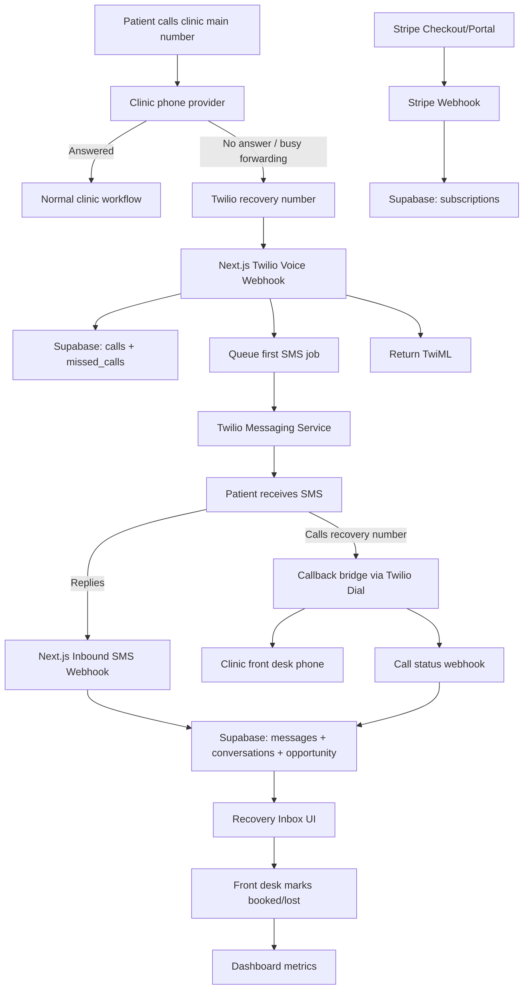

# 02 — Technical Architecture

Project: Missed-Call Recovery SaaS for Dental Clinics  
Version: MVP Build Spec v1  
Stage: 2 — Architecture  
Primary audience: AI coding agent / technical founder

---

## 1. Purpose of this file

This file defines the technical architecture for the MVP.

The goal is to give the AI coding agent a clear view of:

- the application stack;
- the main services;
- how data flows between Twilio, the app, Supabase, Stripe, and the UI;
- the runtime boundaries;
- the production constraints;
- the non-negotiable engineering rules for the MVP.

This file does not define every database column or endpoint in full detail. Those are covered in:

- `03-database-schema.md`
- `04-api-and-webhooks.md`
- `05-sms-rules-and-templates.md`
- `06-ui-screens.md`
- `07-build-plan-and-tasks.md`

---

## 2. Product architecture summary

We are building a narrow SaaS product for small dental clinics.

The product does one thing:

> When a dental clinic misses a phone call, the system automatically texts the caller, qualifies the need, creates a recovery opportunity, and lets the front desk manually mark whether the patient was recovered/booked.

The MVP is not:

- a phone system replacement;
- an AI receptionist;
- a dental CRM;
- a PMS integration;
- a call recording/transcription platform;
- an automated appointment booking engine.

The system is a **recovery layer** on top of the clinic's existing phone number.

---

## 3. Recommended MVP stack

### 3.1 Frontend

Use:

- **Next.js**
- TypeScript
- Tailwind CSS
- Server Components where useful
- Client Components for interactive inbox/detail actions

Suggested app structure:

```txt
app/
  (auth)/
    login/
    signup/
  (app)/
    dashboard/
    inbox/
    opportunities/[id]/
    settings/
    billing/
  admin/
  api/
    webhooks/
    messages/
    opportunities/
    clinics/
```

The UI should be simple. The MVP does not need a complex design system.

---

### 3.2 Backend

Use:

- Next.js route handlers for API endpoints;
- Supabase Postgres for persistence;
- Supabase Auth for authentication;
- server-side Supabase client for protected app actions;
- service-role Supabase client only inside trusted server code and webhook handlers;
- background jobs for delayed SMS/follow-ups.

The backend must support:

- public Twilio webhooks;
- public Stripe webhook;
- authenticated app APIs/actions;
- background jobs;
- idempotent processing;
- audit/event logging.

---

### 3.3 Database

Use:

- Supabase Postgres
- SQL migrations
- Row Level Security for user-facing tables
- service-role access for webhooks/background jobs
- `jsonb` for raw provider payloads
- unique constraints for provider event idempotency

Core database objects:

- `clinics`
- `profiles`
- `phone_numbers`
- `patients`
- `calls`
- `missed_calls`
- `conversations`
- `messages`
- `appointment_opportunities`
- `followups`
- `templates`
- `automations`
- `subscriptions`
- `webhook_events`
- `audit_logs`

Detailed schema is in `03-database-schema.md`.

---

### 3.4 Telephony and SMS

Use:

- **Twilio Voice** for recovery number inbound calls and callback bridge;
- **Twilio Messaging** for outbound/inbound SMS;
- one recovery number per clinic;
- one Messaging Service per clinic for clean operational boundary and opt-out handling.

MVP assumption:

```txt
1 clinic = 1 Twilio recovery number = 1 Twilio Messaging Service
```

The clinic keeps its existing main number.

The clinic configures its phone provider to forward unanswered/busy calls to the Twilio recovery number.

---

### 3.5 Billing

Use:

- Stripe Checkout for subscription start;
- Stripe Customer Portal for payment method updates, invoices, cancellations;
- Stripe webhooks for local subscription state.

Important business rule:

> Trial should start only when clinic is activation-ready, not immediately after signup.

Reason:

A2P/10DLC and onboarding can delay the real go-live date. The clinic should not lose trial days before the product is capable of sending real patient SMS.

---

### 3.6 Hosting

Use:

- Vercel for the Next.js application;
- Supabase hosted Postgres/Auth;
- Twilio and Stripe as external services.

For MVP, a single production app is acceptable.

Recommended environments:

```txt
local       developer machine
staging     optional but strongly recommended before live clinic tests
production  real clinic usage
```

---

## 4. High-level system diagram



---

## 5. Core runtime flows

### 5.1 Missed call detection flow

Trigger:

A call hits the clinic's Twilio recovery number.

Flow:

1. Twilio sends a POST request to `/api/webhooks/twilio/voice/incoming`.
2. Backend validates `X-Twilio-Signature`.
3. Backend finds clinic by `To` phone number.
4. Backend checks idempotency by `CallSid`.
5. Backend creates a `calls` record.
6. Backend decides whether this is likely:
   - forwarded missed call;
   - patient callback;
   - unknown.
7. If forwarded missed call:
   - create `missed_calls` record;
   - create/open `patients` record;
   - create/open `conversations` record;
   - schedule first SMS;
   - return short TwiML apology + hangup.
8. If callback:
   - return TwiML `<Dial>` to clinic's callback destination.
9. Store raw payload for debugging.

MVP default:

If uncertain, classify as `forwarded_missed_call` rather than attempting to bridge the call.

---

### 5.2 First SMS flow

Trigger:

A missed call has been detected.

Flow:

1. Background job checks whether first SMS has already been sent for this missed call.
2. Job checks patient opt-out state.
3. Job selects template:
   - business-hours template;
   - after-hours template;
   - locale if supported.
4. Job sends SMS via Twilio Messaging Service.
5. Job stores outbound message row.
6. Twilio status callbacks update message status.
7. Conversation becomes visible in inbox.

Default timing:

```txt
First SMS: 10–20 seconds after missed call detection
```

Implementation may start with immediate enqueue + short delay.

---

### 5.3 Inbound SMS flow

Trigger:

Patient replies to recovery SMS.

Flow:

1. Twilio sends POST to `/api/webhooks/twilio/messaging/incoming`.
2. Backend validates Twilio signature.
3. Backend finds clinic by `To` or `MessagingServiceSid`.
4. Backend finds/creates patient by `From`.
5. Backend finds open conversation.
6. Backend stores inbound message.
7. If `OptOutType` exists, update consent/opt-out state.
8. Otherwise classify intent and urgency.
9. Update conversation.
10. Create/update appointment opportunity.
11. Cancel pending follow-up jobs.
12. Show updated conversation in Recovery Inbox.

---

### 5.4 Follow-up flow

Trigger:

A missed call conversation has no reply/callback after the first SMS.

Rules:

- follow-up 1 after 15 minutes;
- follow-up 2 next business day at 9:00 AM clinic local time;
- maximum 3 automated outbound messages per missed-call incident;
- any patient reply cancels future automated follow-ups;
- any callback cancels future automated follow-ups;
- STOP/opt-out cancels all future automated messages.

Implementation options:

- Supabase cron + scheduled job table;
- Vercel Cron or Supabase scheduled job;
- external queue later if needed.

For MVP, a `followups` table with periodic polling is acceptable.

---

### 5.5 Callback bridge flow

Trigger:

Patient calls the recovery number after receiving SMS.

Flow:

1. Twilio sends voice webhook to `/api/webhooks/twilio/voice/incoming`.
2. Backend detects this is likely a callback if there is an open recovery conversation and the previous outbound SMS occurred before this inbound call.
3. Backend returns TwiML `<Dial>` to clinic's callback destination number.
4. Twilio attempts to connect patient to clinic.
5. Twilio sends child-call status callbacks to `/api/webhooks/twilio/voice/call-status`.
6. Backend logs call progress and updates opportunity state.

MVP callback TwiML pattern:

```xml
<?xml version="1.0" encoding="UTF-8"?>
<Response>
  <Dial answerOnBridge="true" timeout="15">
    <Number
      statusCallbackEvent="initiated ringing answered completed"
      statusCallback="https://app.example.com/api/webhooks/twilio/voice/call-status"
      statusCallbackMethod="POST">
      +13125550000
    </Number>
  </Dial>
</Response>
```

---

### 5.6 Manual outcome flow

Trigger:

Front desk works the conversation.

Flow:

1. Front desk opens Recovery Inbox.
2. Front desk opens opportunity detail.
3. Front desk reads message history and intent.
4. Front desk contacts patient or completes scheduling manually.
5. Front desk marks opportunity as:
   - booked/recovered;
   - contacted but not booked;
   - lost;
   - spam/wrong number;
   - duplicate.
6. Dashboard updates metrics.

Important:

The MVP does not automatically write appointments into the dental PMS.

---

### 5.7 Billing flow

Trigger:

Clinic is activation-ready.

Flow:

1. Clinic signs up and enters basic clinic info.
2. Internal/admin onboarding completes Twilio number, Messaging Service, A2P/compliance, forwarding test, SMS test.
3. Clinic status becomes `activation_ready`.
4. Owner can start trial through Stripe Checkout.
5. Stripe webhook creates/updates local subscription.
6. Trial starts.
7. Stripe webhooks keep subscription state in sync.
8. Customer Portal handles card updates/cancellation/invoices.

Do not start the trial at initial signup.

---

## 6. Application modules

### 6.1 Auth module

Responsibilities:

- login;
- signup;
- password reset if implemented;
- session management;
- user profile creation;
- clinic membership.

Use Supabase Auth.

Minimum roles:

```txt
owner
front_desk
admin
```

MVP may implement `admin` as an internal flag in `profiles`.

---

### 6.2 Clinic settings module

Responsibilities:

- clinic name;
- main phone number;
- recovery number;
- callback destination number;
- timezone;
- business hours;
- after-hours behavior;
- emergency instruction text;
- average recovered appointment value;
- SMS templates if editable.

---

### 6.3 Twilio voice module

Responsibilities:

- signature validation;
- incoming call handling;
- forwarded missed call detection;
- callback detection;
- TwiML generation;
- call status callback handling;
- raw payload logging;
- idempotency.

---

### 6.4 Twilio messaging module

Responsibilities:

- outbound SMS sending;
- inbound SMS handling;
- status callback handling;
- opt-out processing;
- template rendering;
- message idempotency;
- delivery/error tracking.

---

### 6.5 Recovery rules module

Responsibilities:

- first SMS timing;
- follow-up scheduling;
- business-hours logic;
- intent detection;
- urgency detection;
- follow-up cancellation;
- max automated message count per incident.

For MVP this should be deterministic, not LLM-based.

---

### 6.6 Recovery inbox module

Responsibilities:

- show open conversations;
- prioritize urgent conversations;
- show patient thread;
- show missed call metadata;
- show automation/follow-up status;
- allow manual action:
  - mark contacted;
  - mark booked;
  - mark lost;
  - pause automation;
  - add note.

---

### 6.7 Dashboard module

Responsibilities:

- missed calls;
- SMS sent;
- replies;
- callbacks;
- urgent opportunities;
- booked/recovered opportunities;
- estimated recovered revenue;
- basic date filtering.

MVP dashboard should be simple and operational.

---

### 6.8 Billing module

Responsibilities:

- Stripe Checkout;
- Stripe Customer Portal;
- subscription state;
- trial state;
- payment failure state;
- local access gating based on clinic status.

---

### 6.9 Admin/concierge module

Responsibilities:

- list clinics;
- view clinic setup status;
- store Twilio SIDs;
- store A2P/campaign status manually if needed;
- activation checklist;
- send test SMS;
- view recent webhooks/errors;
- mark clinic activation-ready.

The first 5–10 clinics should be launched concierge-style.

---

## 7. Clinic status model

Clinic lifecycle statuses:

```txt
signup_started
profile_incomplete
setup_in_progress
a2p_pending
forwarding_pending
qa_pending
activation_ready
trialing
active
past_due
paused
cancelled
```

Meaning:

| Status | Meaning |
|---|---|
| `signup_started` | Owner created account; setup has not meaningfully started. |
| `profile_incomplete` | Required clinic/business/contact fields are missing. |
| `setup_in_progress` | Clinic basics entered; Twilio/admin setup not complete. |
| `a2p_pending` | Messaging registration/compliance is pending. |
| `forwarding_pending` | Recovery number exists but clinic call forwarding is not verified. |
| `qa_pending` | Technical setup done but live missed-call/SMS/callback tests are not passed. |
| `activation_ready` | Product is technically ready; trial can start. |
| `trialing` | Stripe trial is active. |
| `active` | Paid subscription active. |
| `past_due` | Payment issue. |
| `paused` | Clinic intentionally paused. |
| `cancelled` | Subscription cancelled / service disabled. |

Access rule:

- `activation_ready`, `trialing`, and `active` clinics can process live patient recovery.
- `signup_started`, `profile_incomplete`, `setup_in_progress`, `a2p_pending`, `forwarding_pending`, and `qa_pending` should not send real automated patient SMS unless explicitly enabled by admin for testing.

---


## 8. Configuration and secrets model

Do not use one giant `env/.env.secrets.example` and `config/runtime.config.example.ts` for every setting.

Use two separate artifacts:

```txt
config/runtime.config.example.ts
env/.env.secrets.example
```

### 8.1 Non-secret runtime config

Use `config/runtime.config.example.ts` for:

```txt
NEXT_PUBLIC_APP_URL
NEXT_PUBLIC_SUPABASE_URL
NEXT_PUBLIC_SUPABASE_ANON_KEY
TWILIO_ACCOUNT_SID
TWILIO_API_KEY_SID
TWILIO_DEFAULT_MESSAGING_SERVICE_SID
STRIPE_PRICE_ID_MONTHLY
STRIPE_PRICE_ID_ANNUAL
SENTRY_DSN
trial days
follow-up defaults
support/admin emails
```

These are not private passwords. Some still differ between local/staging/production.

### 8.2 Secret runtime values

Use `.env.local` locally and Vercel Environment Variables for staging/production.

Secret names are listed in:

```txt
env/.env.secrets.example
```

Required secrets:

```txt
SUPABASE_SERVICE_ROLE_KEY
TWILIO_AUTH_TOKEN
TWILIO_API_KEY_SECRET
STRIPE_SECRET_KEY
STRIPE_WEBHOOK_SECRET
```

Rules:

- never commit `.env.local`;
- never expose server secrets to client components;
- never prefix private secrets with `NEXT_PUBLIC_`;
- production secrets should be added only after staging passes.

### 8.3 AI/MCP access model

The AI coding agent should not ask for human collaborator invites by default.

Instead:

```txt
local repo access -> VS Code/Codex workspace
Supabase -> staging/dev project, optionally via Supabase MCP
Vercel -> preview/staging project, optionally via Vercel MCP
Stripe -> sandbox/test mode, optionally via Stripe MCP
Twilio -> Twilio MCP docs/API-spec server + dashboard/API credentials configured by owner
```

See:

```txt
11-access-and-secrets-handoff.md
14-ai-codex-vscode-workflow.md
15-mcp-setup.md
```

## 9. Idempotency rules

Provider webhooks can be retried, duplicated, or delivered out of order.

The MVP must use unique constraints and explicit idempotency logic.

### 9.1 Twilio Voice

Unique key:

```txt
twilio_call_sid
```

Rules:

- one `calls` row per Twilio `CallSid`;
- one `missed_calls` row per qualifying parent call;
- duplicate voice webhooks should return valid TwiML but not duplicate product records.

---

### 9.2 Twilio Messaging

Unique key:

```txt
twilio_message_sid
```

Rules:

- one `messages` row per inbound/outbound Twilio `MessageSid`;
- status callbacks update existing message rows;
- duplicated status callbacks should be harmless.

---

### 9.3 Stripe

Unique key:

```txt
stripe_event_id
```

Rules:

- store all processed Stripe event IDs;
- ignore duplicate events;
- subscription state should be derived from Stripe payloads but stored locally.

---

### 9.4 Background jobs

Use deterministic job keys where possible.

Examples:

```txt
first_sms:{missed_call_id}
followup_1:{missed_call_id}
followup_2:{missed_call_id}
```

Rules:

- no duplicate first SMS for the same missed call;
- no follow-up after reply/callback/opt-out/closed outcome;
- max 3 automated outbound messages per missed-call incident.

---

## 10. Security requirements

### 10.1 Webhook security

Twilio webhooks:

- validate `X-Twilio-Signature`;
- reject invalid signatures;
- log rejected attempts without storing sensitive full payload if not necessary.

Stripe webhooks:

- validate `Stripe-Signature`;
- use raw request body for verification;
- store processed event IDs.

---

### 10.2 App security

- RLS must prevent clinic users from seeing other clinics' data.
- Only admins can access admin/concierge screens.
- Webhook handlers should use service-role client only server-side.
- Never expose service-role key to browser.
- Do not store unnecessary PHI.
- Do not implement call recording in MVP.
- Do not store media attachments in MVP.

---

### 10.3 SMS content safety

MVP messages should focus on:

- missed call recovery;
- scheduling coordination;
- general urgency routing;
- front desk follow-up.

Avoid:

- diagnosis;
- detailed symptoms;
- prescriptions;
- insurance details;
- x-rays or attachments;
- patient financial data;
- unnecessary sensitive medical information.

---

## 11. Logging and monitoring

Minimum logs:

### Provider logs

- Twilio webhook received;
- Twilio signature validation result;
- Twilio API send result;
- Twilio delivery status updates;
- Stripe webhook received;
- Stripe signature validation result.

### Product logs

- missed call detected;
- first SMS scheduled;
- first SMS sent;
- inbound reply received;
- intent detected;
- urgent opportunity created;
- follow-up scheduled/cancelled;
- opportunity marked booked/lost.

### Business logs

- recovered appointment;
- estimated recovered revenue;
- clinic activation;
- subscription status changes.

Recommended implementation:

- `webhook_events` table for raw webhook event summaries;
- `audit_logs` table for product/admin/user actions;
- external error monitoring later.

---

## 12. Alerting requirements

MVP should eventually alert internal admin when:

- incoming Twilio voice webhook returns non-200;
- SMS is not sent within 60 seconds of missed call detection;
- outbound SMS failed/undelivered rate is high;
- A2P/compliance status remains pending for too long;
- urgent conversation has no front desk action during business hours;
- Stripe payment fails for active clinic;
- webhook signature verification fails repeatedly.

MVP may start with admin dashboard visibility instead of real-time Slack/email alerts, but the database should support these checks.

---

## 13. Background job architecture

### 13.1 MVP approach

Use a `followups` table as a durable job schedule.

A scheduled worker runs every minute and processes due jobs.

Pseudo-flow:

```txt
Every minute:
  select followups where scheduled_for <= now and job_status = 'pending'
  for each followup:
    lock row / mark processing
    re-check cancellation conditions
    send SMS if allowed
    mark sent or skipped
```

Cancellation conditions:

- conversation closed;
- appointment opportunity booked/lost;
- patient replied;
- patient called back;
- patient opted out;
- clinic inactive/past_due/cancelled;
- max automated SMS reached.

---

### 13.2 Later approach

If needed, move to:

- pg-boss;
- Inngest;
- Trigger.dev;
- BullMQ;
- dedicated worker service.

Do not add a complex queue before the MVP needs it.

---

## 14. Data privacy posture

This is a healthcare-adjacent product.

MVP posture:

- minimize sensitive content;
- do not ask patients for detailed medical info;
- do not store recordings;
- do not store attachments;
- store only what is needed for recovery workflow;
- keep raw provider payloads for debugging but be careful with retention later;
- document that front desk is responsible for actual scheduling and clinical decisions.

---

## 15. Engineering non-negotiables

The AI coding agent should treat these as hard requirements:

1. Every Twilio/Stripe webhook must be signature-validated.
2. Every provider event must be idempotent.
3. Every database table exposed to clinic users must have RLS.
4. The app must support one clinic/user boundary from the beginning.
5. No AI receptionist in MVP.
6. No PMS integration in MVP.
7. No call recording/transcription in MVP.
8. No automatic appointment booking in MVP.
9. Follow-up SMS must stop after reply, callback, opt-out, or close.
10. Trial must start only after activation-ready status.
11. Admin/concierge workflow must exist for first clinics.
12. The dashboard should measure recovered appointments, not just message volume.

---

## 16. Recommended folder structure

```txt
app/
  (auth)/
    login/page.tsx
    signup/page.tsx
  (app)/
    layout.tsx
    dashboard/page.tsx
    inbox/page.tsx
    opportunities/[id]/page.tsx
    settings/page.tsx
    billing/page.tsx
  admin/
    clinics/page.tsx
    clinics/[id]/page.tsx
  api/
    webhooks/
      twilio/
        voice/incoming/route.ts
        voice/call-status/route.ts
        messaging/incoming/route.ts
        messaging/status/route.ts
      stripe/route.ts
    messages/send/route.ts
    opportunities/[id]/mark-booked/route.ts
    opportunities/[id]/mark-lost/route.ts
    clinics/[id]/settings/route.ts

lib/
  supabase/
    server.ts
    service-role.ts
    client.ts
  twilio/
    client.ts
    validate-signature.ts
    twiml.ts
    send-sms.ts
  stripe/
    client.ts
    webhook.ts
  recovery/
    detect-call-type.ts
    classify-intent.ts
    schedule-followups.ts
    cancel-followups.ts
    state-machine.ts
  phone/
    normalize-e164.ts
  auth/
    require-user.ts
    require-clinic.ts
    require-admin.ts

supabase/
  migrations/
  seed.sql

scripts/
  process-followups.ts
  seed-default-templates.ts
```

---

## 17. Suggested implementation order

1. Next.js + Supabase Auth foundation.
2. Core schema migrations.
3. Clinic settings and admin setup status.
4. Twilio incoming voice webhook.
5. Missed call creation and first SMS sending.
6. Twilio inbound SMS webhook.
7. Intent/urgency detection.
8. Recovery Inbox UI.
9. Opportunity detail + mark booked/lost.
10. Follow-up scheduler.
11. Callback bridge.
12. Stripe billing.
13. Admin/concierge QA panel.
14. Deployment and production hardening.

The detailed task plan is in `07-build-plan-and-tasks.md`.

---

## 18. Open implementation decisions

These can be decided during development but should not change the product scope.

### Decision 1: Background job mechanism

MVP default:

- `followups` table + scheduled worker.

Alternative later:

- Inngest / Trigger.dev / pg-boss.

Recommendation:

Start with Vercel Cron calling `/api/jobs/process-due-followups` or a Supabase scheduled job calling the same secured endpoint. Do not add a complex queue until production usage proves it is needed.

---

### Decision 2: Admin implementation

MVP default:

- `profiles.is_internal_admin = true` for platform admins, plus `clinic_memberships.role` for clinic-level owner/front-desk roles.

Alternative:

- separate admin auth / internal tool.

Recommendation:

Use the simple approach for first clinics.

---

### Decision 3: Editable templates

MVP default:

- templates stored in DB, editable only by admin or owner if simple.

Alternative:

- hardcoded templates first.

Recommendation:

Seed default templates in DB so later customization is easier.

---

### Decision 4: Staging environment

MVP default:

- local + staging + production.

Recommendation:

Use staging before onboarding a real clinic because Twilio/Stripe webhooks are easy to misconfigure.

---

## 19. Done criteria for architecture stage

This architecture stage is complete when:

- stack is accepted;
- app boundaries are clear;
- external services are clear;
- clinic status model is accepted;
- Twilio/SMS architecture is accepted;
- billing activation rule is accepted;
- database schema work can begin;
- API/webhook spec can be written without major product ambiguity.
