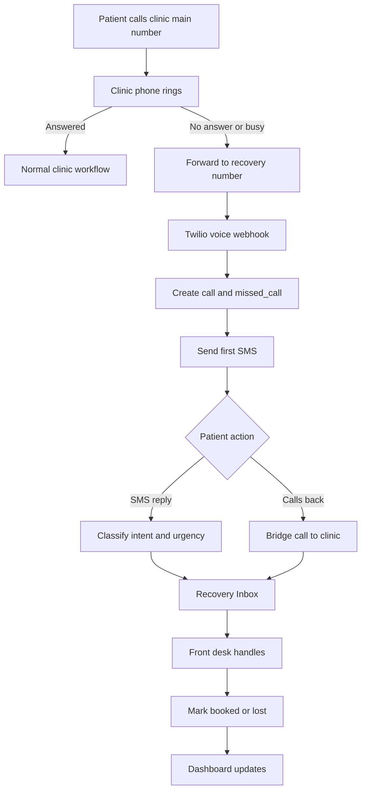

# MVP Build Spec v1 — Missed-Call Recovery SaaS for Dental Clinics

Project: Missed-call recovery SaaS  
Version: v1  
Status: Final reviewed master file  
Audience: AI coding agent / technical implementer

---

## 1. Purpose of this master spec

This is the master build specification for a narrow SaaS MVP that helps small dental clinics recover missed calls.

This master spec locks:

- product scope;
- user roles;
- core workflow;
- MVP boundaries;
- the documentation map for the implementation files.

The detailed implementation instructions live in the numbered files `00` through `15` plus `AGENT-RULES.md` in this package.

---

## 2. Product definition

We are building:

> A missed-call recovery layer for small dental clinics.

The app detects when a clinic misses a call, sends a recovery SMS, qualifies the patient's intent, shows the conversation to the front desk, and lets the clinic manually mark the opportunity as booked or lost.

---

## 3. One-line positioning

> Turn missed calls into booked dental appointments automatically.

---

## 4. MVP product boundary

### Build this

- One recovery number per clinic.
- Missed-call detection through no-answer / busy forwarding.
- Twilio voice webhook.
- SMS recovery flow.
- Inbound SMS handling.
- Deterministic dental intent detection.
- Urgent message prioritization.
- Recovery inbox.
- Manual mark booked/lost.
- Owner dashboard.
- Stripe subscription after activation.
- Admin/concierge setup tools for early clinics.

### Do not build this in v1

- AI receptionist.
- Voice bot.
- Full CRM.
- PMS integration.
- Automatic appointment booking.
- Number porting.
- Hosted SMS as default.
- Call recording or transcription.
- Diagnosis or clinical advice.
- Multi-location enterprise features.

---

## 5. Recommended product architecture

The clinic keeps its main public phone number. The app provides a separate Twilio recovery number.

```text
Clinic main number
  -> no-answer / busy forwarding
  -> Twilio recovery number
  -> app voice webhook
  -> missed-call incident
  -> SMS recovery
  -> recovery inbox
  -> manual booked/lost outcome
```

This keeps the MVP simple and avoids replacing the clinic's existing phone system.

---

## 6. Actors

| Actor | Role in the product |
|---|---|
| Patient | Calls clinic, receives SMS, replies or calls back |
| Front desk | Handles recovery inbox and marks outcomes |
| Clinic owner | Configures clinic, reviews dashboard, manages billing |
| Platform admin | Helps onboard first clinics and manages activation |
| Twilio | Voice/SMS provider |
| Stripe | Billing provider |

---

## 7. Main workflow



---

## 8. User flows included in Stage 1

Detailed user flows are defined in `01-user-flows.md`.

Covered flows:

1. Clinic signup and setup.
2. Normal answered call.
3. Missed call creates recovery incident.
4. First SMS after missed call.
5. Patient replies by SMS.
6. Urgent dental issue.
7. No reply / follow-ups.
8. Patient calls recovery number back.
9. Front desk handles conversation.
10. Owner reviews dashboard.
11. Patient opts out.
12. Admin activates first pilot clinics.

---

## 9. Documentation package plan

The final AI-agent build package contains:

```text
START-HERE.md
AGENT-RULES.md
MVP-Build-Spec-v1.md
README-build-docs-roadmap.md
00-product-brief.md
01-user-flows.md
02-technical-architecture.md
03-database-schema.md
04-api-and-webhooks.md
05-sms-rules-and-templates.md
06-ui-screens.md
07-build-plan-and-tasks.md
08-compliance-and-onboarding.md
09-test-plan.md
10-env-and-deploy.md
11-access-and-secrets-handoff.md
12-production-launch-checklist.md
13-hosting-decision-no-fly.md
14-ai-codex-vscode-workflow.md
15-mcp-setup.md
OWNER-FILL-THIS-OUT.md
config/runtime.config.example.ts
env/.env.secrets.example
mcp/mcp.config.example.json
REVIEW-NOTES.md
```

## 10. Stages

### Stage 1 — Product scope and flows

Status: complete in this package.

Files:

```text
README-build-docs-roadmap.md
MVP-Build-Spec-v1.md
00-product-brief.md
01-user-flows.md
```

### Stage 2 — Architecture and database

Files:

```text
02-technical-architecture.md
03-database-schema.md
```

### Stage 3 — APIs and SMS rules

Files:

```text
04-api-and-webhooks.md
05-sms-rules-and-templates.md
```

### Stage 4 — UI and implementation tasks

Files:

```text
06-ui-screens.md
07-build-plan-and-tasks.md
```

### Stage 5 — Testing, deployment, onboarding

Files:

```text
08-compliance-and-onboarding.md
09-test-plan.md
10-env-and-deploy.md
11-access-and-secrets-handoff.md
12-production-launch-checklist.md
13-hosting-decision-no-fly.md
14-ai-codex-vscode-workflow.md
15-mcp-setup.md
AGENT-RULES.md
```

---

## 11. Implementation stack

Detailed technical architecture will be defined in `02-technical-architecture.md`.

Current recommended stack:

```text
Frontend: Next.js / React
Backend: Next.js API routes or server routes
Database: Supabase Postgres
Auth: Supabase Auth
Voice/SMS: Twilio
Billing: Stripe
Hosting: Vercel
Background jobs: Vercel Cron or Supabase scheduled jobs
```

---

## 12. Database summary

Detailed schema will be defined in `03-database-schema.md`.

Expected core tables:

```text
clinics
profiles/users
phone_numbers
patients
calls
missed_calls
conversations
messages
appointment_opportunities
followups
templates
automations
subscriptions
audit_logs
```

---

## 13. API summary

Detailed endpoints will be defined in `04-api-and-webhooks.md`.

Expected endpoints:

```text
POST /api/webhooks/twilio/voice/incoming
POST /api/webhooks/twilio/voice/call-status
POST /api/webhooks/twilio/messaging/incoming
POST /api/webhooks/twilio/messaging/status
POST /api/webhooks/stripe
POST /api/messages/send
POST /api/opportunities/:id/mark-booked
POST /api/opportunities/:id/mark-lost
PATCH /api/clinics/:id/settings
```

---

## 14. SMS rules summary

Detailed SMS automation rules will be defined in `05-sms-rules-and-templates.md`.

Initial rules:

```text
First SMS: 10–20 seconds after missed call
Follow-up 1: 15 minutes later if no reply/callback/opt-out
Follow-up 2: next business day around 9:00 clinic local time
Max automated SMS per incident: 3
Any reply cancels pending follow-ups
Any callback cancels pending follow-ups
STOP cancels pending follow-ups and blocks future sends
```

---

## 15. UI summary

Detailed UI screens will be defined in `06-ui-screens.md`.

Expected screens:

```text
Login
Signup
Onboarding
Dashboard / Overview
Recovery Inbox
Opportunity Detail
Settings
Billing
Admin / Concierge Panel
```

---

## 16. Build task summary

Implementation milestones will be defined in `07-build-plan-and-tasks.md`.

Expected milestones:

1. App foundation.
2. Database migrations.
3. Twilio voice webhook.
4. SMS sending.
5. Incoming SMS handling.
6. Recovery inbox UI.
7. Follow-ups.
8. Callback bridge.
9. Stripe billing.
10. Admin/QA tools.

---

## 17. Definition of done for MVP

The MVP is done when:

- clinic can be created and configured;
- recovery number can receive forwarded calls;
- missed call creates incident;
- first SMS is sent;
- inbound SMS is received and classified;
- urgent replies are prioritized;
- front desk can manage opportunities;
- front desk can mark booked/lost;
- dashboard shows recovered opportunity metrics;
- patient callback can bridge to clinic;
- follow-up automation respects reply/callback/opt-out rules;
- Stripe billing exists;
- admin can manually activate and support pilot clinics.


## 15. AI coding agent execution model

This package assumes the MVP is built by an AI coding agent in the founder's VS Code/Codex/CodeGPT/VibeCode environment. The agent should use local files, optional MCP connectors, staging/test provider resources, and approval gates. It should not ask for production secrets or human collaborator invites by default. See `AGENT-RULES.md`, `14-ai-codex-vscode-workflow.md`, and `15-mcp-setup.md`.
