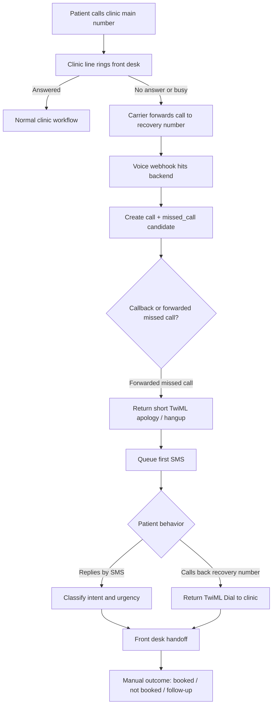
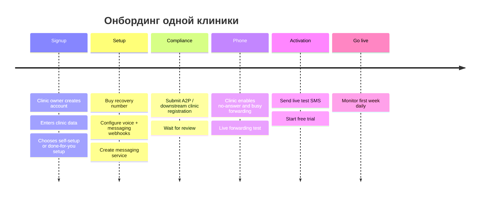

# Спецификация MVP для missed-call recovery SaaS в стоматологии

## Резюме

Лучший MVP здесь — не «телефония для клиник», не AI receptionist и не dental CRM, а очень тонкий слой recovery поверх существующего номера клиники: **пропущенный звонок → мгновенный SMS → простая dental-квалификация → handoff на front desk → ручная отметка recovered/booked**. Технически это реалистично, дешево и быстро, потому что опирается на существующий номер клиники, call forwarding и стандартные webhook/TwiML-механики, а не требует замены телефонной системы целиком. citeturn13view0turn10view1turn10view3

Самое важное неочевидное ограничение находится не в коде, а в messaging compliance. Для отправки SMS с американского local 10DLC номера из приложения нужен A2P 10DLC; в документации указано, что trial-аккаунты не могут зарегистрироваться, а review кампаний сейчас занимает примерно 10–15 дней. Из этого следует практическое решение: **14-day free trial должен стартовать не в день signup, а в день live activation**, иначе trial будет «сгорать» на этапе комплаенса. citeturn21view0turn10view7

Для SaaS, который шлет сообщения **от лица клиник**, вы фактически ведете себя как ISV: у вас должен быть собственный Twilio business profile, а для каждой клиники — downstream customer profile / brand / campaign. Это не делает идею плохой, но означает, что первые 5–10 клиник почти наверняка придется запускать concierge-style, вручную проводя регистрацию и activation QA. citeturn29view1turn29view0

Одно-number решение «1 clinic = 1 recovery number» допустимо для v0.1 и хорошо совпадает с вашим позиционированием safety net, а не phone replacement. Но в нем есть один архитектурный нюанс: параметр `ForwardedFrom` у Twilio существует, однако сам Twilio оговаривает, что carrier может не всегда передать эту информацию. Поэтому различение между **forwarded missed call** и **patient callback** нужно строить как `ForwardedFrom if present` + эвристика по истории conversation/state, а не полагаться на один carrier signal. citeturn13view0

Итоговая рекомендация: **build — but only if** вы сознательно принимаете четыре условия v0.1:  
первое — manual downstream A2P onboarding;  
второе — trial starts on activation;  
третье — booked appointment в начале подтверждается вручную front desk;  
четвертое — вы не расширяете scope в AI receptionist, PMS sync и number porting до появления первых платящих клиник. citeturn21view0turn29view0turn29view1

## Позиционирование и ICP

**One-line positioning**

**Turn missed calls into booked dental appointments automatically.**

Эта формулировка правильная, потому что обещает не «общение по телефону», а **денежный результат**: вернуть потерянный intake и довести его до записи. Она также естественно противопоставляется тяжелым all-in-one системам: вы продаете не новую телефонную платформу, а recovery-layer для уже существующего номера клиники.

**Target customer profile**

Лучший ICP для v0.1 — это независимые small dental clinics в США с 1–3 dentists, маленьким front desk, без внутреннего IT, с заметной долей новых пациентов по телефону и с текущей болью «owner тратит деньги на marketing, а входящие calls теряются из-за занятости ресепшна». Чтобы продукт запускался быстро, у клиники должно быть одно из двух: либо текущий провайдер телефона поддерживает **No Answer / Busy Call Forwarding**, либо front desk готов вместе с вами включить это через портал/звездочные коды. citeturn27view2turn27view1turn27view0turn9search0

**Что делает продукт именно dental-specific, а не generic missed-call SMS**

Dental-vertical появляется не из слова “dental” на лендинге, а из четырех вещей:

Во-первых, intent model должен быть dental-native: **new patient, existing patient, tooth pain / urgent, cleaning, appointment request, reschedule**. Во-вторых, handoff должен идти не «в общий inbox», а в owner/front desk queue c приоритетом urgent pain. В-третьих, success metric должен быть не отправленный SMS, а **appointment opportunity** и **recovered appointment**. В-четвертых, контент должен быть максимально операционным и не лезть в PHI: scheduling, callback, urgency, but not diagnosis. Это делает продукт достаточно отличимым от generic missed-call text-back и объясняет цену $99–199, которую нельзя сравнивать с дешевым phone app. Это уже продукт про **revenue recovery**, а не только про texting.

**Граница MVP**

Продаваемый MVP должен обещать только три исхода:

1. клиника больше не теряет каждый пропущенный звонок бесследно;  
2. пациент сразу получает понятный dental-specific SMS;  
3. owner видит, сколько missed calls превратились в opportunities и bookings.

Если продукт начнет обещать voice AI, full inbox replacement, автоматическую запись в PMS и universal phone migration, вы проиграете по времени запуска раньше, чем дойдете до первых 5 клиник.

## Операционный поток звонка и SMS

Лучшая ментальная модель для v0.1 — это **fallback safety net**, а не новый номер клиники. Основной номер клиники остается прежним и продолжает жить в Google Business Profile, на сайте, в визитках и в рекламе. Recovery number не публикуется как основной; он только принимает no-answer / busy forward и становится patient-visible уже после missed call, когда система шлет SMS. Это снижает сопротивление клиники и упрощает onboarding.

Ниже — рекомендуемый call flow. Он опирается на то, что входящий voice webhook приходит на Twilio number, Twilio ожидает TwiML в ответ, а для callback bridge можно использовать `<Dial>` c `answerOnBridge`, `timeout` и `statusCallbackEvent`. В voice webhook Twilio передает `CallSid`, `From`, `To`, `CallStatus`, `Direction`, а иногда и `ForwardedFrom`; Twilio отдельно документирует, что `ForwardedFrom` зависит от carrier support и может отсутствовать. citeturn13view0turn10view1turn14view1turn14view3



**Exact user flow**

Если front desk отвечает — продукт не участвует.

Если front desk не отвечает или линия занята, текущий carrier пересылает звонок на recovery number. Это и есть ваш missed-call detector: вам не нужно строить собственный call analytics-движок на стороне клиники; событие forwarding уже означает, что звонок не был принят в основной линии в нужный момент.

Когда recovery number получает вызов, backend делает пять вещей синхронно и асинхронно:

первое — валидирует `X-Twilio-Signature`;  
второе — дедуплицирует по `CallSid`;  
третье — создает `calls` record и `missed_calls` candidate;  
четвертое — классифицирует звонок как likely forwarded miss или likely callback;  
пятое — либо возвращает TwiML для короткого missed-call response, либо TwiML callback bridge на номер клиники. citeturn7search4turn10view10turn13view0

**Как различать missed call и callback при схеме 1 clinic = 1 number**

Для v0.1 рекомендую такую логику:

- если `ForwardedFrom` присутствует и совпадает с main clinic number, считать вызов forwarded missed call;  
- если `ForwardedFrom` отсутствует, но по этому `From` уже есть открытый recovery conversation и последний outbound recovery SMS был отправлен **до** текущего входящего вызова, считать это callback;  
- если нет ни `ForwardedFrom`, ни открытого recovery conversation, считать вызов forwarded missed call;  
- если определение неоднозначно, безопаснее сначала отдать короткое missed-call greeting и SMS, а не пытаться соединять с клиникой повторно.  

Это не идеально, но для ultra-narrow MVP приемлемо. Критично лишь документировать этот edge case и заложить upgrade path: если misclassification станет значимой проблемой, v0.2 может добавить скрытый ingestion number и отдельный callback number.

**Рекомендуемый missed-call voice response**

Для forwarded missed call лучше не оставлять тишину и не строить мини-IVR. Достаточно 1–2 предложений и разрыва:

```xml
<?xml version="1.0" encoding="UTF-8"?>
<Response>
  <Say>Sorry we missed your call. We'll text you right away.</Say>
  <Hangup/>
</Response>
```

Это сохраняет узкий scope: вы не притворяетесь phone system, но даете человеку понятный переход к SMS.

**Рекомендуемый callback bridge**

Для callback лучше использовать `<Dial>` с `answerOnBridge="true"` и child-call status callbacks. По умолчанию `<Dial>` может показать клинике caller ID пациента; именно это поведение обычно полезно, потому что front desk видит знакомый patient number, а не неизвестный system number. `timeout` у `<Dial>` по умолчанию 30 секунд, минимум 5, максимум 600, причем Twilio добавляет примерно 5 секунд buffer — это важно при настройке опыта callback. citeturn14view1turn14view0turn14view3turn13view0

```xml
<?xml version="1.0" encoding="UTF-8"?>
<Response>
  <Dial answerOnBridge="true" timeout="15">
    <Number
      statusCallbackEvent="initiated ringing answered completed"
      statusCallback="https://app.example.com/api/webhooks/twilio/voice/call-status"
      statusCallbackMethod="POST">
      +13125550000
    </Number>
  </Dial>
</Response>
```

Практически для MVP это дает правильный UX: пациент нажимает “Call Back” из SMS, recovery number автоматически дозванивается до front desk, а ваш backend получает child-call events `initiated`, `ringing`, `answered`, `completed`, чтобы вы могли посчитать callback attempt и outcome. citeturn13view0turn1search5

## Конфигурация телефонии и backend

Техническая основа MVP — urlTwiliohttps://www.twilio.com для voice/SMS и urlStripehttps://stripe.com для subscriptions. На стороне Twilio важно не просто купить номер, а правильно собрать всю конфигурацию вокруг него: number, Messaging Service, compliance, voice URL, message URL и status callbacks. Twilio документирует, что номер покупается через Console в разделе Numbers & Senders, а voice/message webhooks для номера задаются прямо в Console; message status callbacks задаются либо через REST API при отправке сообщения, либо на уровне Messaging Service. citeturn15view0turn15view1turn15view2turn6search7

**Минимальная production-ready конфигурация одной клиники**

- 1 recovery number  
- 1 Messaging Service  
- 1 clinic record  
- 1 main clinic number в настройках  
- 1 business-hours policy  
- 1 active A2P brand/campaign или альтернативный compliant sender path  
- 1 Stripe subscription  
- 1 open recovery inbox per clinic

Причина использовать **one Messaging Service per clinic** в том, что Advanced Opt-Out, keyword management и localized opt-out/help responses живут именно на уровне Messaging Service и применяются ко всем senders в его pool. В односендерной схеме per clinic это самый чистый operational boundary. citeturn19view0turn31view0

### Сравнение вариантов доставки SMS

С точки зрения MVP есть только один реально быстрый путь: отдельный recovery number. Hosted SMS и porting полезны, но оба резко увеличивают время и операционную сложность.

| Вариант | Рекомендация | Плюсы | Минусы | Стоимость и сложность |
|---|---|---|---|---|
| Отдельный recovery number | **Да для MVP** | Быстро купить, просто подключить voice/SMS webhooks, просто объяснить как fallback safety net | Пациент видит не основной номер клиники; нужен forwarding; для local 10DLC нужен A2P onboarding | Самый дешевый и быстрый |
| Hosted SMS на текущем номере | **Позже как premium** | Пациент переписывается с настоящим номером клиники; trust выше | Twilio Hosted Number Orders сейчас в Developer Preview / not intended for new customers; нужно ownership verification и LoA | Выше операционная сложность |
| Полный porting номера | **Нет для MVP** | Один «истинный» номер для voice+SMS | Превращает продукт в phone migration project; процесс обычно 5–15 дней, иногда до 4 недель | Слишком медленно для early pilot |

Эта таблица опирается на официальную документацию Twilio: покупка номера через Console доступна сразу; Hosted SMS требует verification/LoA и в текущей документации помечен как developer preview для hosted numbers; full porting занимает 5–15 дней и может затянуться дольше при отказах. citeturn15view0turn15view3turn15view4turn15view5

### Twilio setup checklist

**Что нужно сделать для одной клиники**

1. upgrade вашего аккаунта с trial на paid — trial accounts не могут проходить A2P 10DLC registration;  
2. buy local number в Console;  
3. создать one Messaging Service для клиники;  
4. включить Advanced Opt-Out на Messaging Service;  
5. настроить voice webhook URL на recovery number;  
6. настроить inbound message webhook URL;  
7. настроить message delivery status callback;  
8. зарегистрировать клинику в Trust Hub / A2P flow как downstream customer, если вы SaaS-ISV;  
9. прикрепить phone number к Messaging Service / campaign;  
10. провести live forwarding test и live SMS test. citeturn21view0turn19view0turn31view0turn29view0turn29view1

### Webhook endpoints

Twilio voice и messaging webhooks по умолчанию приходят как `application/x-www-form-urlencoded`; Stripe webhooks приходят как JSON. Для обоих провайдеров нужно валидировать подписи: Twilio использует `X-Twilio-Signature`, а Stripe — `Stripe-Signature`. Twilio отдельно предупреждает, что набор параметров status callbacks со временем может меняться, поэтому endpoint должен принимать эволюционирующий payload, а не жестко падать из-за неожиданного поля. citeturn10view3turn7search4turn10view10turn10view6turn3search1

| Endpoint | Метод | Источник | Формат | Что делает |
|---|---|---|---|---|
| `/api/webhooks/twilio/voice/incoming` | POST | recovery number inbound voice | form-encoded | Создает `calls`, определяет callback vs missed call, возвращает TwiML |
| `/api/webhooks/twilio/voice/call-status` | POST | `<Number statusCallback>` | form-encoded | Обновляет child-call outcome: initiated/ringing/answered/completed |
| `/api/webhooks/twilio/messaging/incoming` | POST | inbound SMS | form-encoded | Создает inbound message, парсит intent, обрабатывает STOP/HELP/START |
| `/api/webhooks/twilio/messaging/status` | POST | outbound SMS `StatusCallback` | form-encoded | Обновляет `queued/sent/delivered/undelivered/failed`, пишет `ErrorCode` |
| `/api/webhooks/stripe` | POST | billing events | JSON | Заводит/обновляет subscription, trial, payment failure |
| `/api/messages/send` | POST | internal app | JSON | Ставит задачу на отправку SMS |
| `/api/opportunities/{id}/mark-booked` | POST | internal app | JSON | Ручная фиксация recovered appointment |
| `/api/clinics/{id}/settings` | PATCH | internal app | JSON | Обновляет main number, business hours, templates, emergency text |

Структура endpoint’ов и их роли следуют из стандартных возможностей Twilio Voice/Messaging webhooks и Stripe subscription webhooks. citeturn13view0turn10view3turn32view1turn22view2turn22view3

### Примеры webhook payloads

Twilio присылает form-encoded параметры; ниже — **нормализованное JSON-представление**, как его лучше хранить в `payload_json` для отладки и replay. Для voice webhook важны `CallSid`, `From`, `To`, `CallStatus`, `Direction`, а `ForwardedFrom` может присутствовать не всегда. Для inbound SMS важны `MessageSid`, `From`, `To`, `Body`, `NumMedia`; для outbound status callbacks — `MessageStatus` и `ErrorCode`. citeturn13view0turn30view0turn32view1

```json
{
  "source": "twilio.voice.incoming",
  "CallSid": "CA1234567890abcdef1234567890abcd",
  "AccountSid": "AC1234567890abcdef1234567890abcd",
  "From": "+15551234567",
  "To": "+18885550123",
  "CallStatus": "ringing",
  "Direction": "inbound",
  "ForwardedFrom": "+13125550000",
  "ApiVersion": "2010-04-01"
}
```

```json
{
  "source": "twilio.voice.child_call_status",
  "CallSid": "CAchild1234567890abcdef1234567890",
  "ParentCallSid": "CAparent1234567890abcdef12345678",
  "From": "+15551234567",
  "To": "+13125550000",
  "CallStatus": "answered",
  "Direction": "outbound-dial",
  "CallDuration": "94"
}
```

```json
{
  "source": "twilio.messaging.incoming",
  "MessageSid": "SM1234567890abcdef1234567890abcd",
  "AccountSid": "AC1234567890abcdef1234567890abcd",
  "MessagingServiceSid": "MG1234567890abcdef1234567890abcd",
  "From": "+15551234567",
  "To": "+18885550123",
  "Body": "3",
  "NumMedia": "0"
}
```

Если у вас включен Advanced Opt-Out и входящее сообщение совпало с keyword’ом opt-out/help/opt-in, Twilio может дополнительно прислать `OptOutType` со значением `STOP`, `HELP` или `START`, причем сам confirmation reply уже будет отправлен Twilio. citeturn31view0

```json
{
  "source": "twilio.messaging.incoming",
  "MessageSid": "SMabcdefabcdefabcdefabcdefabcdef",
  "From": "+15551234567",
  "To": "+18885550123",
  "Body": "STOP",
  "OptOutType": "STOP"
}
```

Stripe после успешного checkout и в ходе жизненного цикла подписки шлет JSON events вроде `checkout.session.completed`, `customer.subscription.created`, `customer.subscription.trial_will_end`, `invoice.paid`, `invoice.payment_failed`. Локально вам нужно хранить `event.id` и делать idempotent processing. citeturn22view2turn22view3turn22view4turn10view6

```json
{
  "id": "evt_1Example",
  "type": "checkout.session.completed",
  "data": {
    "object": {
      "id": "cs_test_123",
      "customer": "cus_123",
      "subscription": "sub_123",
      "mode": "subscription"
    }
  }
}
```

## Модель данных, правила сообщений и dashboard

База для этого продукта должна хранить не просто calls и messages, а **incident graph**: звонок, missed-call incident, conversation, opportunity и outcome. Иначе вы не сможете нормально ответить на главный бизнес-вопрос owner’а: «сколько пропущенных звонков реально вернулось в записи». При этом idempotency должна быть встроена в схему: уникальные индексы по `CallSid`, `MessageSid` и `Stripe event id` — обязательны.

### Краткая схема БД

| Таблица | Ключевые поля | Индексы |
|---|---|---|
| `clinics` | `id`, `name`, `main_phone_e164`, `recovery_phone_e164`, `timezone`, `business_hours_json`, `default_locale`, `emergency_instruction`, `avg_recovered_value_cents`, `status` | `main_phone_e164`, `recovery_phone_e164` |
| `users` | `id`, `clinic_id`, `email`, `role`, `name`, `phone_e164`, `active` | `clinic_id,email` unique |
| `phone_numbers` | `id`, `clinic_id`, `e164`, `purpose`, `twilio_number_sid`, `messaging_service_sid`, `a2p_campaign_sid`, `active` | `e164` unique |
| `calls` | `id`, `clinic_id`, `twilio_call_sid`, `from_e164`, `to_e164`, `forwarded_from_e164`, `direction`, `raw_status`, `detected_type`, `started_at`, `ended_at`, `duration_sec`, `payload_json` | `twilio_call_sid` unique, `clinic_id,from_e164,started_at` |
| `missed_calls` | `id`, `clinic_id`, `call_id`, `patient_id`, `status`, `detected_at`, `sms_first_sent_at`, `callback_started_at`, `handed_off_at`, `closed_at`, `close_reason` | `call_id` unique, `clinic_id,status,detected_at` |
| `patients` | `id`, `clinic_id`, `phone_e164`, `first_name`, `is_existing_patient`, `preferred_locale`, `consent_status`, `opted_out_at`, `last_seen_at` | `clinic_id,phone_e164` unique |
| `conversations` | `id`, `clinic_id`, `patient_id`, `open_missed_call_id`, `state`, `intent`, `urgency`, `owner_user_id`, `last_message_at` | `clinic_id,patient_id,state` |
| `messages` | `id`, `clinic_id`, `conversation_id`, `twilio_message_sid`, `direction`, `channel`, `template_key`, `ab_variant`, `body_redacted`, `status`, `error_code`, `sent_at`, `delivered_at`, `payload_json` | `twilio_message_sid` unique, `clinic_id,status,sent_at` |
| `appointment_opportunities` | `id`, `clinic_id`, `patient_id`, `missed_call_id`, `intent`, `urgency`, `status`, `estimated_value_cents`, `booked_at`, `booked_value_cents`, `front_desk_notes` | `clinic_id,status,booked_at` |
| `followups` | `id`, `clinic_id`, `missed_call_id`, `conversation_id`, `step_key`, `scheduled_for`, `sent_message_id`, `job_status` | `clinic_id,scheduled_for,job_status` |
| `templates` | `id`, `clinic_id`, `key`, `locale`, `channel`, `ab_variant`, `body`, `active`, `version` | `clinic_id,key,locale,ab_variant` unique |
| `automations` | `id`, `clinic_id`, `enabled`, `after_hours_enabled`, `first_sms_delay_sec`, `followup_1_delay_min`, `followup_2_delay_business_days`, `callback_timeout_sec` | `clinic_id` unique |
| `subscriptions` | `id`, `clinic_id`, `stripe_customer_id`, `stripe_subscription_id`, `status`, `trial_start_at`, `trial_end_at`, `current_period_end_at`, `cancel_at_period_end` | `stripe_subscription_id` unique |
| `audit_logs` | `id`, `clinic_id`, `actor_type`, `actor_id`, `event_type`, `object_type`, `object_id`, `changes_json`, `created_at` | `clinic_id,created_at` |

### Event and state transitions

Рекомендую отделить **raw carrier state** от **product state**. Carrier state живет в `calls` и `messages`, product state — в `missed_calls`, `conversations`, `appointment_opportunities`.

| Событие | Product transition | Побочный эффект |
|---|---|---|
| Voice webhook получает forwarded missed call | `new -> detected` | Создать `calls`, `missed_calls`, поставить job на first SMS |
| First SMS job создан | `detected -> sms_pending` | Подготовить template и idempotency key |
| SMS accepted/queued/sent | `sms_pending -> sms_sent` | Записать `MessageSid`, открыть conversation |
| Inbound SMS reply | `sms_sent -> engaged` | Определить intent/urgency, обновить opportunity |
| Callback bridge started | `sms_sent/engaged -> callback_in_progress` | Логировать call leg statuses |
| Callback answered или front desk берет в работу reply | `callback_in_progress/engaged -> handoff_pending` | Назначить owner/assignee |
| User marks booked | `handoff_pending -> recovered` | Записать `booked_at`, revenue |
| User marks not booked | `handoff_pending -> closed_lost` | Остановить follow-ups |
| STOP / opt-out | `any open state -> opted_out` | Заблокировать future sends, закрыть scheduled follow-ups |

Twilio для outbound SMS шлет status changes вроде `queued`, `sent`, `delivered`, `undelivered`, `failed`; в callback приходят `MessageStatus` и `ErrorCode`. Для child voice calls через `<Dial><Number>` доступны `initiated`, `ringing`, `answered`, `completed`. Эти provider-level состояния и должны питать product state machine, а не заменять ее. citeturn11view6turn11view7turn32view1turn13view0

### Правила SMS и retry policy

Самая рабочая стратегия для v0.1 — **не conversational AI**, а deterministic rules engine.

**Rules**

- первый SMS: через 10–20 секунд после завершения forwarded call;  
- follow-up 1: через 15 минут, если нет reply, callback и opt-out;  
- follow-up 2: на следующий рабочий день в 9:00 local clinic time, если incident все еще открыт;  
- не больше 3 automated outbound SMS на один missed-call incident;  
- любой inbound SMS отменяет дальнейшие automated nudges;  
- любой callback to recovery number отменяет follow-up 1 и 2;  
- STOP/HELP/START обрабатываются на уровне Messaging Service и сохраняются также в вашей DB;  
- после-hours template используется, если missed call попал вне business hours клиники.

**Delivery retry policy**

Нужно различать **API retry** и **patient follow-up**.

Если ваш send job не получил `MessageSid` из API из-за network/app error, делайте retry по backoff, например 10 секунд → 60 секунд → 5 минут, максимум 3 попытки.

Если `MessageSid` уже получен, но затем приходит `failed` или `undelivered`, не делайте бесконечный resend-loop. Для MVP достаточно одного controlled resend через 15 минут только если: сообщение было именно технически недоставлено, пациент не opt-out, и resend step еще не использован. Во всех остальных случаях лучше создать internal task для front desk/ops. Twilio также рекомендует, если message status не обновился до `delivered` или `undelivered` в течение 12 часов, опросить Message resource вручную. citeturn32view1turn6search2

### Шаблоны SMS

Ниже — готовый минимальный набор. Для американских клиник production default должен быть **EN**, но я включаю и **RU** как requested localization. Для opt-out в реальном продакшене обязательно оставляйте English keywords visible, даже если используете русский текст, потому что Twilio reserved keywords и stop-flow в США крутятся вокруг STOP/START/HELP; Twilio поддерживает language-specific keywords, включая Russian, но literal localization нужно настраивать вручную. citeturn31view0

| Template key | English | Русский |
|---|---|---|
| `first_missed_call_a` | Hi, this is {clinic_name}. Sorry we missed your call. What do you need help with? Reply: 1 New patient, 2 Existing patient, 3 Tooth pain, 4 Cleaning, 5 Reschedule. Reply STOP to opt out. | Здравствуйте, это {clinic_name}. Извините, мы пропустили ваш звонок. Чем помочь? Ответьте: 1 Новый пациент, 2 Действующий пациент, 3 Боль/срочно, 4 Чистка, 5 Перенос записи. Для отказа: STOP. |
| `first_missed_call_b` | Sorry we missed you at {clinic_name}. Text us what you need and our front desk will help: new patient, cleaning, tooth pain, appointment, or reschedule. Reply STOP to opt out. | Извините, мы пропустили ваш звонок в {clinic_name}. Напишите, что вам нужно: новый пациент, чистка, боль, запись или перенос. Для отказа: STOP. |
| `new_patient` | Thanks for contacting {clinic_name}. Are you looking for your first appointment? Reply with your preferred day/time and our front desk will text or call you back. | Спасибо, что написали в {clinic_name}. Это ваш первый визит? Напишите удобный день/время, и front desk свяжется с вами. |
| `existing_patient` | Thanks — we can help. Please text your name and what you need: checkup, follow-up, crown, filling, or other. | Спасибо — мы поможем. Напишите, пожалуйста, ваше имя и что вам нужно: осмотр, контроль, коронка, пломба или другое. |
| `emergency` | We marked this as urgent. If you have swelling, trauma, uncontrolled bleeding, or severe pain, please call the office now at {main_phone}. If this is life-threatening, call 911. | Мы отметили это как срочное. Если есть отек, травма, сильное кровотечение или сильная боль, пожалуйста, срочно позвоните в клинику: {main_phone}. В экстренной ситуации звоните 911. |
| `cleaning_request` | Great — we’ll help you with a cleaning visit. Reply with mornings / afternoons and the best day for you. | Отлично — поможем записаться на чистку. Напишите, пожалуйста, утро/день и удобный день. |
| `appointment_request` | Thanks. What day works best for your appointment, and are you a new or existing patient? | Спасибо. Какой день вам удобен для записи, и вы новый или действующий пациент? |
| `reschedule` | No problem — we can help reschedule. Please reply with your name and the best day/time to move your appointment. | Без проблем — поможем перенести запись. Напишите ваше имя и удобный новый день/время. |
| `no_reply_15m` | Just checking in from {clinic_name}. If you still need an appointment, reply here and our front desk will follow up. Reply STOP to opt out. | Напоминаем от {clinic_name}. Если запись все еще нужна, ответьте здесь, и front desk свяжется с вами. Для отказа: STOP. |
| `next_day_followup` | We tried to follow up on your missed call to {clinic_name}. If you still want help booking, text us here and we’ll get back to you. | Мы пишем по поводу вашего пропущенного звонка в {clinic_name}. Если помощь с записью все еще нужна, ответьте здесь, и мы свяжемся с вами. |
| `after_hours` | Thanks for calling {clinic_name}. Our office is currently closed. Reply here and our team will follow up next business day. For urgent dental issues, call {emergency_phone}. Reply STOP to opt out. | Спасибо за звонок в {clinic_name}. Сейчас клиника закрыта. Ответьте здесь, и команда свяжется с вами в следующий рабочий день. По срочным вопросам звоните {emergency_phone}. Для отказа: STOP. |

**Opt-out handling**

Для compliance и операционной простоты рекомендую обязательно использовать Messaging Service c Advanced Opt-Out. Ключевые детали из документации такие:

- Advanced Opt-Out выключен по умолчанию;  
- `stop` — reserved opt-out keyword и его нельзя убрать;  
- `start`/`unstop` — reserved opt-in keywords;  
- `help` — reserved help keyword;  
- Twilio ведет blocked list и после opt-out не отправляет future messages;  
- при matched keyword в webhook приходит `OptOutType`, и Twilio уже сам отправляет confirmation;  
- в opt-out response нельзя класть PII;  
- language-specific keyword/response pairs доступны, включая Russian. citeturn19view0turn31view0

### Dashboard v1

Dashboard должен быть маленьким. Не нужно строить CRM. Достаточно четырех экранов.

| Экран | Что показывает | Must-have actions |
|---|---|---|
| `Overview` | missed calls today, SMS sent, reply rate, callbacks, urgent incidents, recovered opportunities, booked count, estimated recovered revenue | date filter, clinic summary |
| `Recovery Inbox` | список открытых conversations с intent/urgency/status | assign, mark contacted, open patient thread, call clinic/patient, close |
| `Opportunity Detail` | call log, message history, intent, urgency, notes, follow-up schedule, booking outcome | mark booked, mark lost, add note, pause automation |
| `Settings` | main number, recovery number, business hours, emergency text, templates, locale, average appointment value | save settings, send test SMS, test callback bridge |
| `Billing` | trial status, next invoice, payment method, cancel link | open Stripe portal |

**Главные owner metrics**

Для owner достаточно десяти метрик:

- missed calls  
- recovery SMS sent  
- reply rate  
- callback rate  
- urgent incidents  
- appointment opportunities  
- recovered opportunities  
- booked appointments  
- median time to first front-desk action  
- estimated recovered revenue

Это и есть ваш product moat на раннем этапе: generic texting tools показывают messages, а вы показываете **revenue recovery view**.

## Онбординг, биллинг и экономика

Самое важное управленческое решение здесь: **trial должен начинаться на activation date**, а не на signup date. Причина проста: для U.S. local 10DLC у вас есть paid-account requirement и review window примерно 10–15 дней. Если запускать free trial сразу после регистрации клиники, значительная часть trial пройдет еще до первого реального patient SMS. citeturn21view0

Ниже — рекомендуемый timeline одной клиники.



Таймлайн опирается на официальный A2P registration flow, paid-account requirement и review window, а также на Twilio Console flow для покупки номера и настройки webhook’ов. citeturn21view0turn15view0turn15view1turn15view2turn29view0turn29view1

### Self-setup onboarding checklist

| Шаг | Что собираем | UI copy для продукта | Blocking |
|---|---|---|---|
| Clinic basics | clinic name, timezone, practice name for SMS, owner contact | “We do not replace your main phone line.” | Да |
| Main call routing | main clinic number, callback destination number, business hours | “Forward only unanswered or busy calls to your recovery number.” | Да |
| Compliance | legal business name, address, tax/EIN data if needed, website, privacy policy URL, terms URL, authorized rep | “We need this to register clinic messaging correctly.” | Да |
| Patient communications | default locale, after-hours text, emergency phone/instructions, average appointment value | “This helps us route patients correctly and estimate recovered revenue.” | Да |
| Testing | live missed-call test, live callback test, live SMS test | “Call your main line, let it ring through, confirm you receive the text.” | Да |
| Go-live | assign front-desk owner, confirm inbox notifications | “You’ll get notified when a missed call becomes a live opportunity.” | Нет |

Для downstream A2P/ISV onboarding особенно важны business/contact details клиники, а на более позднем шаге — campaign details, message flow, message samples, opt-in/out/help data. В официальных ISV guides отдельно фигурируют brand, campaign, Messaging Service и привязка phone number к campaign. Также в guides есть шаг с privacy policy / terms URLs — этот input лучше собирать прямо в onboarding. citeturn29view0turn21view1

### Инструкции по call forwarding для распространенных провайдеров

Для MVP вам нужны **No Answer Forwarding** и по возможности **Busy Forwarding**. **Не используйте unconditional forwarding** как дефолт, иначе вы обойдете front desk целиком и начнете ломать нормальные answered calls.

| Провайдер | Как включить |
|---|---|
| urlAT&T Businessturn27view2 | `*92` + recovery number + `#` для No Answer; `*90` + number + `#` для Busy; `*93#` и `*91#` для выключения |
| urlVerizon Business Digital Voiceturn27view1 | В User Portal доступны `Always`, `When Busy`, `When no answer`; для `When no answer` можно выбрать число гудков |
| urlT-Mobile Supportturn27view0 | `**61*1+Number#` для no reply; `**67*1+Number#` для busy; `**21*1+Number#` — unconditional, обычно не использовать как дефолт |
| urlComcast Business VoiceEdgeturn9search0 | `*92` для Call Forwarding No Answer; `*93` для деактивации |

Эти инструкции взяты из официальных help pages самих провайдеров; точный UI/feature name может отличаться по тарифу и оборудованию, поэтому в onboarding лучше всегда иметь fallback-текст: “If you don’t see No Answer Forwarding, ask your phone provider to forward unanswered and busy calls to this number.” citeturn27view2turn27view1turn27view0turn9search0

### Биллинг и Stripe flow

Для оплаты рекомендую простой поток на базе urlStripehttps://stripe.com Checkout + Customer Portal:

- owner нажимает Start free trial;  
- создается subscription Checkout Session с 14-day trial;  
- после успеха вы получаете `checkout.session.completed`;  
- subscription локально создается как `trialing`;  
- за 3 дня до конца trial Stripe шлет `customer.subscription.trial_will_end`;  
- после оплаты приходит `invoice.paid`, и вы переводите клинику в `active`;  
- если платеж не проходит, обрабатываете `invoice.payment_failed`;  
- card updates / cancellation / invoices отдаете в Stripe customer portal, а не строите сами. citeturn22view3turn22view2turn22view4turn22view1turn22view0

Самая практичная деталь для вашего pricing: **Checkout создается только когда clinic status = `activation_ready`**, а не сразу после signup. Технически это значит, что внутри продукта нужно иметь две статусы воронки:

- `setup_in_progress`  
- `activation_ready`

И только второй статус дает кнопку “Start 14-day trial”.

### Unit economics на одну клинику

Телеком-себестоимость у такого продукта низкая. По текущим Twilio pricing pages local number стоит около $1.15/month, local SMS long code — $0.0083 как outbound, так и inbound, inbound local voice — $0.0085/min, а outbound local voice — около $0.014/min. При этом A2P fees/pass-through charges не зафиксированы в этой модели и должны считаться как open-ended. citeturn18search10turn18search2turn18search0turn24search4turn21view1

| Компонент | Формула | Пример |
|---|---|---|
| Номер | `1 x $1.15` | `$1.15` |
| SMS | `(outbound + inbound) x $0.0083` | `100 SMS = $0.83` |
| Forwarded missed-call voice minutes | `minutes x $0.0085` | `30 min = $0.255` |
| Callback bridge outbound leg | `minutes x ~$0.014` | `30 min = ~$0.42` |
| Telecom subtotal floor | сумма выше | `~$2.66` |

Практический вывод такой: **telecom floor** у одной небольшой клиники, как правило, будет в низких единицах долларов; реальный fully loaded COGS станет выше из-за A2P fees, hosting, support, alerting и manual onboarding. Поэтому ваш старый тезис про ~$5–15 all-in остается реалистичным, но только если вы учитываете не один Twilio bill, а весь operational envelope.

## Комплаенс, риски и запуск первых клиник

Для стоматологий вопрос не в том, можно ли отправлять вообще любые сообщения, а **какое содержание вы туда кладете** и **на каком юридическом основании**. HHS прямо говорит, что covered providers могут общаться с пациентами электронно при условии reasonable safeguards, и что нужно ограничивать объем раскрываемой информации и уважать запрос пациента на альтернативный канал. Twilio, со своей стороны, говорит, что если workflow может содержать PHI, нужен BAA и нужно использовать только HIPAA-eligible products/services из их текущего списка. citeturn10view9turn25view3turn25view0

Отсюда следует практическое правило для MVP: **не отправляйте в recovery SMS ничего, что выглядит как диагноз или sensitive treatment detail**. Безопасный контент для v0.1 — это scheduling, callback, urgency labeling и общая operational координация. Нежелательный контент — диагноз, insurance detail, x-rays, prescriptions, lab data, подробные симптомы, финансовая информация о пациентах.

**Consent и opt-out**

Twilio A2P campaign onboarding требует описать message flow, samples, opt-in/out/help messaging; carrier compliance для 10DLC строится вокруг verified and consensual traffic. FCC в 2024 дополнительно подтвердил, что revoke consent можно “any reasonable manner” и что такие запросы должны обрабатываться в разумный срок, не более 10 business days. Для MVP safest path такой:

- отправляйте только informational / appointment-recovery texts;  
- собирайте SMS consent в intake forms и на сайте клиники;  
- храните текст consent source в CRM-lite поле или notes;  
- обязательно показывайте STOP/HELP в первом automated SMS;  
- уважайте opt-out немедленно в вашем app, even though regulatory outer limit шире. citeturn21view1turn10view7turn20search2turn31view0

### Monitoring, logging и alerting

В observe-слое MVP не нужно ничего изощренного, но нужно три уровня журналов:

- **provider logs**: raw webhook body + signature validation result;  
- **product logs**: incident state transitions, queued jobs, retries, manual actions;  
- **business logs**: booked/lost outcome and estimated revenue.

Минимальный alerting set должен быть таким:

- Twilio incoming voice webhook non-200 > 0  
- first SMS not sent within 60 seconds after `missed_calls.detected`  
- outbound SMS `failed/undelivered` rate > 10% за сутки по клинике  
- Stripe webhook verification failure  
- `invoice.payment_failed` for active clinic  
- `a2p_pending` > 15 дней  
- every open urgent incident with no front-desk action in 10 minutes during business hours

Обязательная инженерная деталь: webhooks должны быть **idempotent** и быстро отвечать 200/valid TwiML, а тяжелую работу нужно уносить в queue. Для Stripe это особенно важно, потому что Stripe автоматически resend’ит undelivered events до трех дней; для Twilio критично валидировать подпись и не ломаться, если появятся новые параметры в webhook payload. citeturn17search5turn10view6turn10view3turn7search4

### Минимум ручных процессов для первых клиник

Для первых 5–10 клиник я бы **сознательно** оставил manual следующие куски:

- manual downstream A2P registration и follow-up по pending/rejected cases;  
- manual forwarding setup help по телефону или Zoom;  
- manual QA одного live missed-call test и одного callback test на клинику;  
- manual owner review recovered opportunities в конце недели;  
- manual mark-booked confirmation, если front desk забывает обновлять statuses;  
- manual rewrite/approval patient-facing templates для каждой клиники.

Именно эти процессы дадут вам learning loops быстрее, чем попытка автоматизировать все с первого дня.

### Что не входит в MVP

| Out of scope | Почему |
|---|---|
| AI receptionist / voice bot | Взрывает scope и повышает compliance risk |
| Full dental CRM | Это другой продукт и другой selling motion |
| Deep PMS write-back | Интеграционный drag до подтверждения demand |
| Number porting | Превращает вас в telecom migration service |
| Hosted SMS as default | Слишком сложный onboarding для первых пилотов |
| Call recording / transcription | PHI, storage, consent и support burden |
| Multi-location org hierarchies | Не нужен для ICP 1–3 doctors |
| Omnichannel chat/WhatsApp | Ломает фокус ultra-narrow recovery |
| Automated booking inside PMS | Для v0.1 booking outcome можно отмечать вручную |

### Следующие три тактических шага для запуска первых клиник

**Первый шаг** — вывести compliance из «непонятного будущего» в конкретный ops playbook: upgrade из trial, определить себя как ISV, собрать шаблон downstream clinic packet для A2P, и изменить billing logic так, чтобы trial начинался после activation. Без этого вы упретесь не в код, а в queue из pending campaigns. citeturn21view0turn29view1turn29view0

**Второй шаг** — собрать только три рабочих surface’а:  
voice webhook service,  
rules-based SMS flow,  
recovery inbox с ручным mark-booked.  
Не стройте ни CRM, ни AI, ни PMS integrations до того, как хотя бы 5 клиник платят и weekly используют inbox.

**Третий шаг** — запускать первые 5 клиник как concierge pilot с жёстким weekly review: на каждой клинике отслеживать missed calls, first SMS latency, reply rate, callback rate, booked count, и вручную интервьюировать owner/front desk по тому, какие intents реально встречаются и где теряются пациенты.

**Финальная рекомендация**

**Build — but only if** вы принимаете concierge-heavy v0.1 и не пытаетесь перепрыгнуть сразу в «умную» телефонию. Самый сильный продуктовый ход здесь — не sophistication, а дисциплина: один narrow flow, один ICP, один ROI narrative, один dashboard про recovered appointments. Если вы удержите этот фокус, MVP можно собрать быстро, продавать по понятной логике и расширять потом из реально наблюдаемого usage, а не из фантазий о «полноценной dental platform».